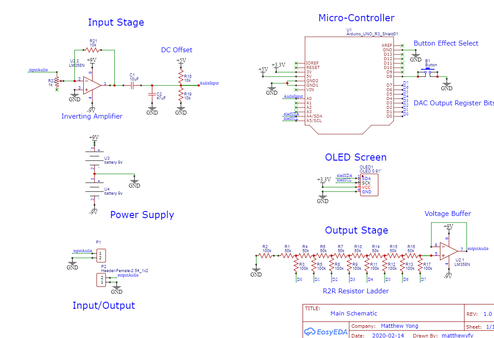

# unoAudioBoard
An Arduino Audio Processor Shield. 
Consists of 6 main audio effects:

* Distortion  
* Bit Crusher  
* Tremolo   
* Flanging  
* Chorusing  
* Phasing   

So far tested device with an audio source (PC/Phone audio) and with a pre-amped electric guitar.  

<div style="text-align: center">
    
    <br>
</div>

## Hardware 
### Schematic Diagram

Link to EasyEda Schematics:
https://easyeda.com/editor#id=170353e9280f4306be4838444f01964b

<div style="text-align: center">
    
    <br><br>
    <a href="schematics.pdf"> Full Schematic in PDF </a>
    <br>
</div>

### System Design

#### Input Stage
- At input stage, inverting amplifier is needed to amplify a signal to a range between 0-5V Amplitude. 
- Capcitor in series blocks DC Components from the input signal.
- Since ADC cannot read negative voltages, we have to offset input signal so that values would be mapped between 0 - 5V (centered about 2.5V).    
- Arduino Audio Input Stage referenced from this tutorial: 
https://www.instructables.com/id/Arduino-Audio-Input/

#### Output Stage
- Arduino does not have a DAC, so an R2R Resistor Ladder is used as a cheap DAC. 
- The R2R DAC Ladder reconstructs digital data (D0-D7) into an analog signal at the end.  
- Signal is buffed by a voltage follower as R2R Circuit has a low output impedance.  
- Arduino Audio Output Stage referenced from this tutorial: 
https://www.instructables.com/id/Arduino-Audio-Output/

### Display and Controls
- The user is able to see the current effect being applied to the signal from the OLED Display.  
- User is also able to tune the input potentiometer to adjust for the input inverting amplifier stage to account for different ranges in input voltage values.    

## Software

Each sample arrives at the ADC Register (from A0 pin) as a value between 0-255. Digital Signal Processing is then used to process each sample according to the selected effect.  

Phasing, Flanging and Chorusing done with digital signal processing reference from the text Digital Signal Processing - Mitra.

Other effects refined and referenced from Electrosmash:
https://www.electrosmash.com/forum/pedalshield-uno/114-how-to-start-programming-pedalshield-uno?lang=en

### Distortion
Mapping each sample to a fixed ampltiude.  
```Arduino
byte fuzzDistortion(int input){
  if (input < 100){
    return 200;
  }
  else if( ( input > 100 ) && ( input < 150) ){
    return 230;
  }
  else {
    return 255;
  }
}
```

### Bit Crusher

Lo-fi digital audio effect, producing distortion by reducing bandwidth of audio.  


```
// Bit Crusher
byte bitCrushBit = 4;
PORTD = ADCH << bitCrushBit;
```

### Tremolo
Modulating each sample onto an existing low frequency carrier wave (Just like Amplitude Modulation).  
```Arduino
byte tremolo(int input){
  // Divider to only apply signal modulation to slow down effect
  if ( divider == 4 ){
   // Reset count if more than array modulate.h array size
   if ( cnt > 1023 ) cnt = 0;
   else cnt++; 
   // Reset divider count to 0     
   divider = 0;
  }
  // Increment divider count
  divider++;
  // Modulate input sample with sine waveform 
  sample = pgm_read_byte(&waveform[cnt]);
  return map(input,0,1023,0,sample);
}
```

### Flanging

Two identical sounds mixed together with one being slightly delayed.  

``` Arduino
byte Flanger(int input){
    
  // Getting Delay based on flanging delay
  int Dvarying = (int)( (SIZE*( 1 - cos((float)(W_FLANG)*current))) );

  // Apply Flanging Effect using difference equation
  LeftOutput = input + ALPHA*buffer[current - Dvarying];

  // Circular Buffer Implementation to store past D values
  buffer[current] = input;
  current++;
  current = current % SIZE;

  return map((int)LeftOutput,0,1023,0,255);
}
```

### Chorusing
Sound effect generated by adding echoes of current sample.  
``` Arduino
byte Chorusing(int input) {
    
  // Getting Delays based on given equations
  int Dvarying1 = (int)( (SIZE*( 1 - cos((float)(PI/SAMPLE_RATE)*current))) );
  int Dvarying2 = (int)( (SIZE*( 1 + cos((float)(PI/SAMPLE_RATE)*current))) );

  // Check if one of them is non negative, apply the non negative term
  if ( (current - Dvarying1 <= 0 ) || (current - Dvarying2 <= 0) ){
    if ( current - Dvarying1 > 0 ) {
      LeftOutput = input + ALPHA*buffer[current - Dvarying1]; 
    }
    else if ( current - Dvarying2 > 0 ) {
      LeftOutput = input + ALPHA*buffer[current - Dvarying2]; 
    }
    else {
      // Both indices are negative
      LeftOutput = input;
    }
  }
  else {
    // Apply Chorusing Effect
    LeftOutput = input + ALPHA*buffer[current - Dvarying1] + ALPHA*buffer[current - Dvarying2];
  }

  // Circular Buffer Implementation to store past D values
  buffer[current] = input;
  current++;
  current = current % SIZE;

  return (map((int)(LeftOutput),0,1023,0,255));
}
```

### Phasing
Sound effect generated by moving a notch filter up and down the frequency spectrum (similar to wah-wah effect).  

``` Arduino
byte Phasing(int input){  
  
  // Implementing sweeping feature of notch
  float varyingNotch = (float)A_1*(1 - cos(W_1*current)) + MIN_FREQ1;
  // Beta values change according to new notch positions
  float beta = (float)cos(varyingNotch);
  // Apply phasing effect to first notch filter
  if ((current - 1) <= 0 || (current - 2) <= 0){
      if ( (current - 1) > 0 ) {
          LeftOutput = ((1+alpha)/2)*bufferInputs[current] - (1+alpha)*beta*bufferInputs[current - 1] 
    + beta*(1 + alpha)*bufferMiddle[current - 1];
    } 
  else if ( (current - 2) > 0 ) {
          LeftOutput = ((1+alpha)/2)*bufferInputs[current] + (1+alpha)*bufferInputs[current - 2] 
    - alpha*bufferMiddle[current - 2];
    }
      else {
        LeftOutput = ((1+alpha)/2)*bufferInputs[current];
    }
  }
    // Apply full difference eqn
  else {
        LeftOutput = 
    ((1+alpha)/2)*bufferInputs[current] - (1+alpha)*beta*bufferInputs[current - 1]
    + (1+alpha)*bufferInputs[current - 2] + beta*(1 + alpha)*bufferMiddle[current - 1]
    - alpha*bufferMiddle[current - 2];
  }

  // Circular Buffer Implementation to store past inputs, middle and outputs
  bufferInputs[current] = input;
  bufferMiddle[current] = LeftOutput;
  current++;
  current = current % 2;

  return map((int)LeftOutput,0,1023,0,255);
}
```


